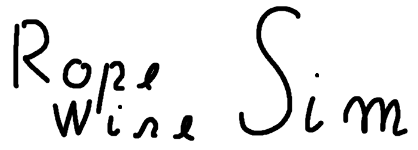

<br />
<div align="center">
  <a href="https://github.com/CalcoDev/Rope-Wire-Simulation">
    
  </a>

  <h3 align="center">Rope / Wire (Verlet integration) Simulation</h3>

  <p align="center">
    A rope / wire (Verlet integration) simulation made in Unity.
    <br />
    <a href="https://github.com/CalcoDev/Rope-Wire-Simulation">View Demo</a>
    ·
    <a href="https://github.com/CalcoDev/Rope-Wire-Simulation/issues">Report Bug</a>
  </p>
</div>

<!-- ABOUT THE PROJECT -->

## About The Project

[![Product Name Screen Shot][product-screenshot]](https://github.com/CalcoDev/Rope-Wire-Simulation)

A rope / wire (Verlet integration) simulation made in Unity and C#.

### Credits

- Sebastian Lague
  - [Youtube](https://www.youtube.com/channel/UCmtyQOKKmrMVaKuRXz02jbQ)
  - [Github](https://github.com/SebLague/Cloth-and-IK-Test/tree/main/Assets/Visualize)

### Built With

- [.NET](https://dotnet.microsoft.com/en-us/)
- [Unity](https://unity.com/)

## How to use

```
git clone https://github.com/CalcoDev/Rope-Wire-Simulation.git verlet-integration
cd verlet-integration
```

Then open the `verlet-integration` in Unity.

## License

Distributed under the MIT License. See `LICENSE.txt` for more information.

<!-- CONTACT -->

## Contact

Calcopod - [@Calcopod](https://twitter.com/Calcopod2)

[product-screenshot]: ./.github/images/product_screenshot.png
